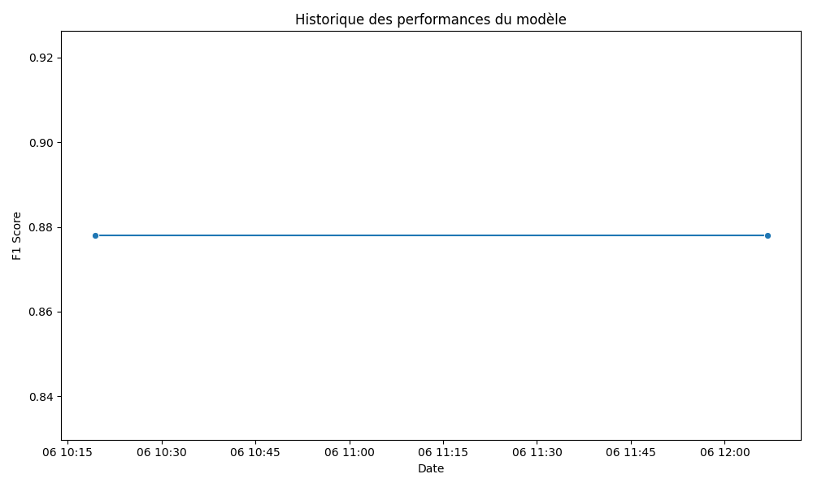

# 🪨📊 DaTa-Liyah
DaTa-Liyah is an open-source tool to help League of Legends professionnal team to reach all the potential of data to help performance and decision making for the staff !📈

Scripts and functions to export scrims and official matchs of League of Legends to JSON file containing data. And use tools to analyse its.  
It use the repo [Rofl-parser](https://github.com/Boris-s-store/rofl-parser.js?tab=readme-ov-file) from [gzordrai](https://github.com/gzordrai) to parse ROFL files.


## 🌱About data
DaTa-Liyah does not come with any data. Bring your own and all the analysis will be done automatically.  
DaTa-Liyah usually uses 3 types of data :
* Games data from ROFL file
* Draft data collected via web scraping from external websites (https://draftlol.dawe.gg/)
* And Soloq data from [Riot games API](https://developer.riotgames.com/)

## 🤔 How to use ?
The first thing to do is to fork this code in a **public, open-source** repo (See [License](LICENSE))
* Go to --> [Streamlit community cloud](https://streamlit.io/cloud)
* Create a new app and select your Github repo
> **Note** : Your webapp is now deployed, but you still need to enter credentials


## ⚙️ Configuration 
You have mostly 3 things to configure :
* [Deploy your personnal MongoDB database](#MongoDB) to store scrims, drafts and more.
* [Deploy your personnal SQLite Cloud database](#SQLite-Cloud) to track Soloq progress of your players (Usage with Riot personnal API Key --> see [Riot Developer Portal](https://developer.riotgames.com/app-type)
* [Create a Google service account](#Google-sheet-draft-history) to keep all the Drafts links used for web scraping.
* [Setup secrets and credentials](#Streamlit-secrets-and-credentials) for the streamlit webapp application and database stuff.

### MongoDB
Section to help you configuring a MongoDB hosted database.  
Do not hesitate to follow MongoDB [documentation](https://www.mongodb.com/docs/) if you need help.  
* Create a MongoDB account and go to Atlas --> ([Link to MongoDB](https://www.mongodb.com/))
* Create a free AWS cluster
* Create a new database (By default the name of the database in the code is : `lol_match_database`)
* Create 2 collections inside (By default : `drafts` and `scrim_matches`)

After this i recommend you to go to the *Security* section of Atlas and to configure the *Database Access* and the *Network Access*.
The goal here is to give access to the database to a limited number of users / or addresses. If you want to whitelist all IP adressess (but cannot access without the right role), add `0.0.0.0/0` to *Network Access*.

> [!TIP]
> Create at least 3 users. One who is the admin of the database. A read-only user, that will perform request from the application. And a read-&-write user. Use it if someone else wants to add data in a collection.

### SQLite Cloud
Section to help you configuring SqliteCloud hosted database.
Go to the main page of SqliteCloud and create an account : [Sqlite Cloud](https://www.sqlite.ai/)
> Name seems to be SqliteAI actually, but we will focus on deploying the Sqlite database, so let's keep the old name.

* Create a new project and a new database inside. (By default : `soloq_tracking.db`)
* Chose to either drag and drop a local database to the cloud or to create it from scratch.
* You must create 6 columns named [date,TOP_RANK,JNG_RANK,MID_RANK,ADC_RANK,SUP_RANK]
* The date column is *__numeric__* and others are *__text__*

After this i recommend you to go to the *Settings* section of Sqlite Cloud and go to *Users* and create many users needed with the rights permissions.

> [!TIP]
> Create at least 3 users. One who is the admin of the database. A read-only user, that will perform request from the application. And a read-&-write user. Use it if someone else wants to add data in a collection.

### Google sheet draft history
My team chose to use Google Sheet to store history and feedback about training and official matches. It's an ergonomic decision to keep this document and add *drafts* links.  
Theses links will serve to do web scraping, catching all the information from a *draft*.  
To allow a script to do requests on a Google Sheet, you should use a service account. (See GCP doc on [service account](https://cloud.google.com/iam/docs/service-account-overview?authuser=1&hl=fr)).  
You will need to store the credentials of this account in a JSON file, keep it in root directory of this repo.  
Change the .env configuration file (see [credentials](#Streamlit-secrets-and-credentials)).  
If you need to change the action made by the script using this service account (mainly looking for the rights cells in the sheet), all of the actions are made [here](https://github.com/PlasmOwO/DaTa-Liyah/blob/main/draft_scraping.py)


### Streamlit secrets and credentials

> [!IMPORTANT]
> Be sure to never commit any configuration or secret file.

You should have a .env file located at the root of the repo like this : 
```env
SPREADSHEET_KEY = "KEY OF YOUR GOOGLE SHEET" #CHANGEME
GOOGLE_CREDENTIALS_PATH = "PATH_JSON_GOOGLE_SERVICE_ACCOUNT.json" #CHANGEME, path of your json file containing logs for the google service account
API_KEY = "RGAPI-XXX-XXX-XXX" #CHANGEME, riotgame api key
SOLOQ_DB_RW_CONNECTION_STRING = "sqlitecloud://XXXXXXX" #CHANGEME, connection string to sqlitecloud database
```

and a file inside `.streamlit/secrets.toml` like this :
```toml
[credentials]
usernames = {XXX = {password = "HASHED_PASSWORD",name = "XXX", email = "XXX@XXX"}} #CHANGEME

[cookie]
expiry_days = X #CHANGEME
key = "XXX"
name = "XXX"

[API_KEY]
API_KEY = "RGAPI-XXX-XXX-XXX" #CHANGEME, riotgame api key

[SOLOQ_DB]
RO_connection_string = "sqlitecloud://XXX" #CHANGEME

[MONGO_DB]
RO_connection_string = "mongodb+XXX" #CHANGEME

[TEAM_SCRIM_ID]
TOP = ["XXX","XXX"] #CHANGEME, list of puuid of the player, the one you will find in json from rofl files
JUNGLE = []
MIDDLE = []
BOTTOM = []
UTILITY = []
```

You should copy the entire `secrets.toml` file inside the hosted app.  


> [!NOTE]
> Having a local `.streamlit/secrets.toml` is only for local / testing developpement or having a backup of what is in the hosted app.
> I recommend you to have it, just in case.

## :computer: Usefull scripts when developing the pattern
`pip install -r requirements.txt`
You will also need to install [nodeJS](https://nodejs.org/en/download) and install with npm : `npm install rofl-parser.js`

With that done you are able to :
* Run script to transfrom ROFL file into JSON `node main.js`
* Run Python scraping to store data of *drafts* into MongoBD `python draft_scraping.py`
* And run the webapp locally : `streamlit run webapp/app.py`

## Machine Learning models

Machine learning models are available in the branch [dev-api](https://github.com/PlasmOwO/DaTa-Liyah/tree/dev-api). 
You can use the [API](https://data-liyah-model-api.onrender.com/docs) to ask an answer from the model. The API is auto deployed using [Render](https://render.com/).
The performance of the model is also auto updated using [Github Action](.github/workflows/update_perf_plot.yml).




